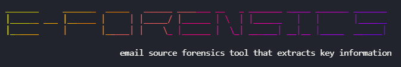
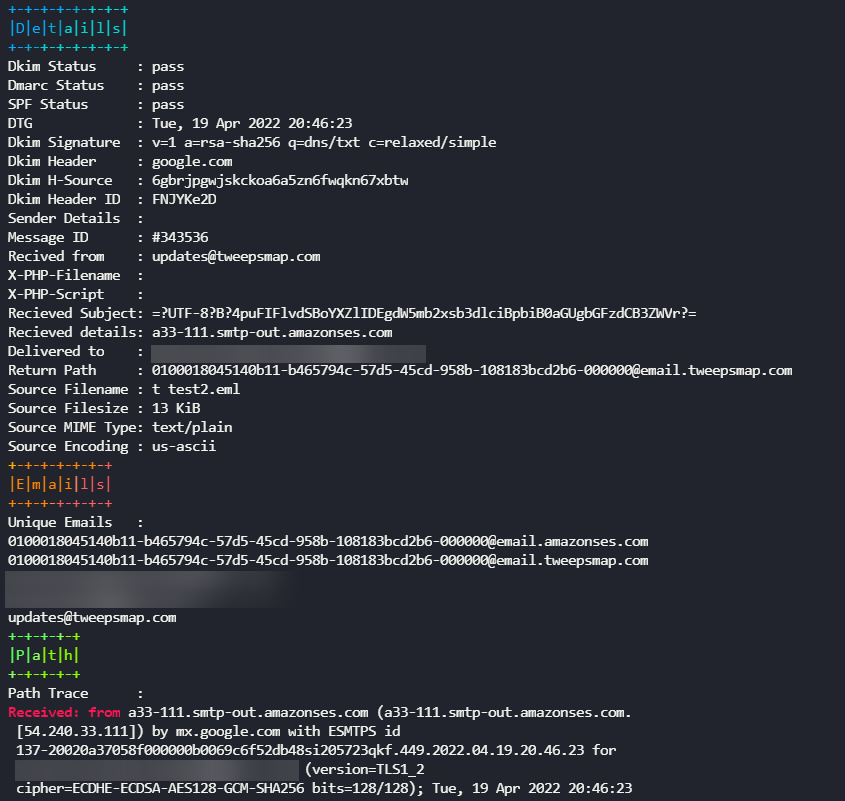
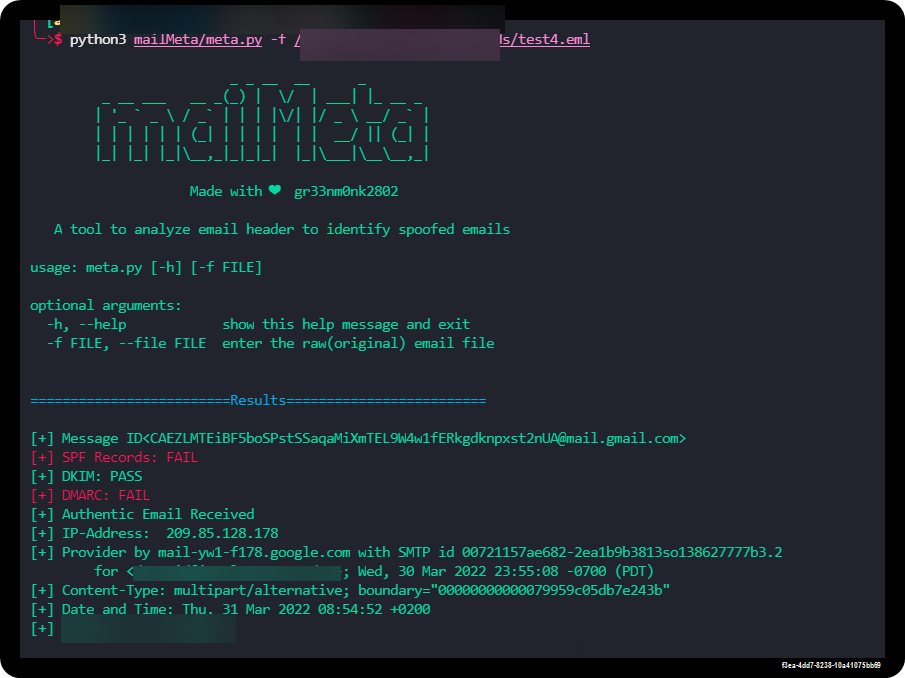

<div align="center">




**Extracts email headers for use in forensics**

</div>

<div align="center">

</div>


```
sudo apt install -y fish
```

```
git clone https://github.com/x543g/E-Forensics.git && cd E-Forensics
fish E-Forensics.fish
```

**Points to note**

- [x] It will install all deps on first launch
- [x] Submit a PR, bug or change as its in beta!

**A comparison to other similar tools**

<div align="center">

</div>